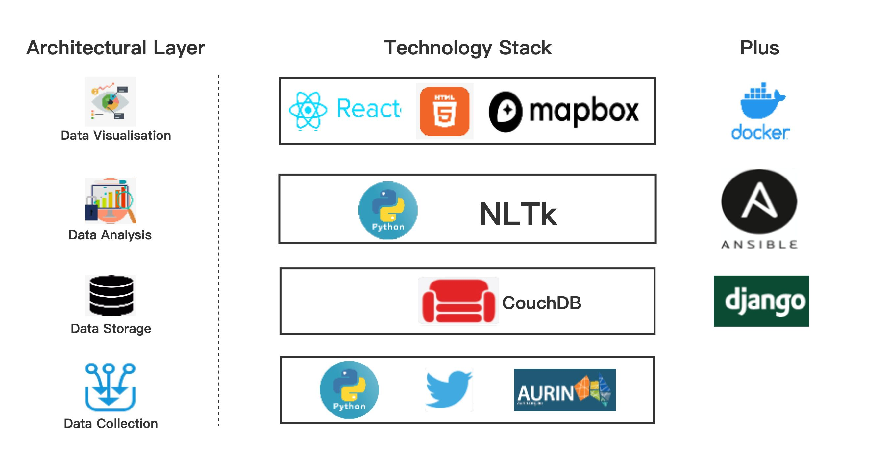

<!--
*** Thanks for checking out the Best-README-Template. If you have a suggestion
*** that would make this better, please fork the repo and create a pull request
*** or simply open an issue with the tag "enhancement".
*** Thanks again! Now go create something AMAZING! :D
-->


<!-- PROJECT SHIELDS -->
<!--
*** I'm using markdown "reference style" links for readability.
*** Reference links are enclosed in brackets [ ] instead of parentheses ( ).
*** See the bottom of this document for the declaration of the reference variables
*** for contributors-url, forks-url, etc. This is an optional, concise syntax you may use.
*** https://www.markdownguide.org/basic-syntax/#reference-style-links
-->


<!-- PROJECT LOGO -->
<br />
<p align="center">


  <h3 align="center">Cloud-Based-COVID-19-Analysis-on-Twitter</h3>

  <p align="center">
    A cloud based COVID-19 Analysis, implemented by React, Django, CouchDB
    <br />
    <br />
    <a href="https://www.youtube.com/watch?v=BRnL2CP1ovQ"><strong>Demonstration video of the frontend visualisation and scenarios analysis »</strong></a>
    <br />
    <br />

  </p>
</p>


<!-- TABLE OF CONTENTS -->
<details open="open">
  <summary>Table of Contents</summary>
  <ol>
    <li>
      <a href="#about-the-project">About The Project</a>
      <ul>
        <li><a href="#built-with">Built With</a></li>
      </ul>
    </li>
    <li><a href="#getting-started">Getting Started</a></li>
    <li><a href="#license">License</a></li>
    <li><a href="#contact">Contact</a></li>
  </ol>
</details>


<!-- ABOUT THE PROJECT -->
## About The Project


This is a cloud-based Web COVID-19 Analysis System finished in 2021, including backend and frontend. The system works on data collected from Australian Urban Research Institution Network (AURIN), and demonstrates 4 COVID-19 related scenarios, top frequently used words in Tweets, COVID cases and heatmaps, LGA development analysis, sentiment analysis. 

The functions include:
* Data Collection by clawer and Twitter API. 
* Data Storage by CouchDB. 
* Data Process and Analysis by MapReduce, NLP algorithms.
* Data Visualization by React.js frontend. 

#### Technology Stack Graph


### Built With

This section should list any major frameworks that you built your project using. Leave any add-ons/plugins for the acknowledgements section. Here are a few examples.
* [MySQL](https://www.oracle.com/au/mysql/)
* [React.js](https://reactjs.org/)
* [HTML5](https://html5.org/)
* [couchDB](http://couchdb.apache.org/)
* [django](https://www.djangoproject.com/)
* [docker](https://www.djangoproject.com/)


<!-- GETTING STARTED -->
## Getting Started

This is an example of how you may give instructions on setting up your project locally.
To get a local copy up and running follow these simple example steps.

The user can use the following Ansible playbook for deployment:

1. 
   ```sh
   ./run-nectar.sh
   ```
   
    This is for setting up 4 instances. Installing Docker and setting up CouchDB
in instance 1,2 and 3

2. 
   ```sh
    ./deploy_cluster.sh
   ```
   This is for setting up the CouchDB cluster.

3. 
   ```sh
   ./run_crawler_cloud.sh
   ```
   This is for deploying the twitter Harvester in instance 1, 2 and 3.
  
4. 
   ```sh
    ./deploy_processing.sh
   ```
   This is for installing Docker, deploying data analyser and data
visualization in instance 4.


<!-- LICENSE -->
## License

Distributed under the MIT License. See `LICENSE` for more information.


<!-- CONTACT -->
## Contact

Your Name - danielkung1997@gmail.com

Project Link: [https://github.com/gszswork/Cloud-Based-COVID-19-Analysis-on-Twitter](https://github.com/gszswork/Cloud-Based-COVID-19-Analysis-on-Twitter)


